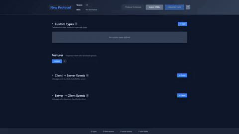

API design can be difficult, but intentionally defining a clear and complete representation of an Event Driven Architecture prior to beginning implementation—when possible—has very clear benefits. Having definition organization and feature completeness at least defined allows the focus to shift from communication complexity to solving logical problems or implementing features.

This tool provides a way to define events and fields, along with a type interface for field types. Protocols designed in the GUI can output YAML, and you can also populate the protocol in the GUI by loading your own  YAML. This tool is for generating type-safe Event Driven Python code and JavaScript as a module with identical type representations built from a single source of defined types.


## Quick Start

### 1. Run the Web Builder

```bash
pip install -r server/requirements.txt
python server/main.py
```

Open **http://localhost:8000**.

### 2. Define Your Protocol

1. Add **Types** (enums like `RoomId`, `MessageType`)
2. Define **Features** (groups of related events, e.g. `Chat`, `Game`)
3. Each feature has **Client Events** (browser → server) and **Server Events** (server → browser)

### 3. Generate & Download

1. Click **Generate Code**
2. Review the output
3. **Download** what you need (server, client, webclient, or all)
4. Extract and edit—it's your code now

---

## Using the Generated Code

The ZIP file contains:

```text
wsprot_export/
├── server/               # Python Server
│   ├── models.py         # Pydantic message classes
│   ├── events.py         # Event dispatcher & decorators
│   ├── handlers.py       # Handler stubs (edit this!)
│   └── ...
├── client/               # Python Client
│   ├── models.py
│   ├── events.py
│   ├── handlers.py       # Handler stubs (edit this!)
│   └── ...
├── webclient/            # JavaScript Client
│   ├── client.js
│   └── ...
└── protocol.yaml         # Original definition
```

### Python Server (FastAPI)

1. Copy the `server/` folder into your project.
2. **Edit `handlers.py` directly** to implement your logic:

```python
# server/handlers.py (edit this file!)
from .models import JoinRoom, Events
from .events import on_event

class ChatHandler:
    def __init__(self, ws):
        self.ws = ws  # Add WebSocket reference
    
    @on_event(Events.Chat.JOIN_ROOM)
    async def chat_join_room(self, message: JoinRoom):
        # Implement your logic here
        print(f"User joining room: {message.room_id}")
        await self.ws.send_json({
            "type": Events.Chat.ROOM_JOINED,
            "room_id": message.room_id
        })
```

3. Create your FastAPI entry point:

```python
# main.py
from fastapi import FastAPI, WebSocket, WebSocketDisconnect
from server.handlers import ChatHandler
from server.events import ClientDispatcher

app = FastAPI()

@app.websocket("/ws")
async def websocket_endpoint(ws: WebSocket):
    await ws.accept()
    handler = ChatHandler(ws)
    dispatcher = ClientDispatcher(handler)
    
    try:
        while True:
            data = await ws.receive_text()
            await dispatcher(data)
    except WebSocketDisconnect:
        print("Client disconnected")
```

4. Run:

```bash
uvicorn main:app --reload
```

### JavaScript Client

The `webclient/` folder contains a ready-to-use client:

- **`client.js`**: Generated SDK with typed methods
- **`main.js`**: Your application logic (edit this!)
- **`index.html`**: Entry point


1. **Design** your protocol in the visual builder
2. **Generate** starter code once
3. **Edit** the generated code directly—it's now your code
4. **Build** your application


## Requirements

- Python 3.8+
- `fastapi`, `uvicorn`, `pydantic`, `pyyaml`, `websockets`
